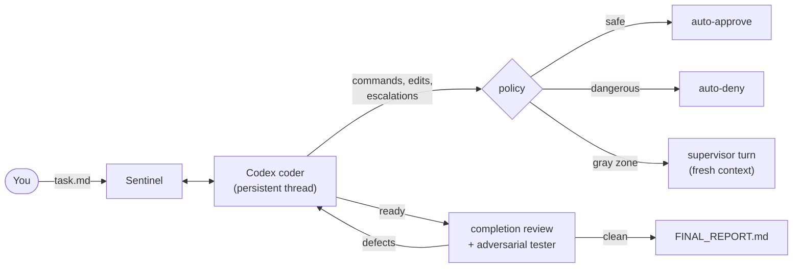

<h1 align="center">Sentinel</h1>

<p align="center">
  <strong>Walk away while an autonomous coding agent does the work, safely.</strong><br>
  A persistent Codex coder writes the code. A separate supervisor owns approvals,
  steering, restarts, and the final quality gate.
</p>

<p align="center">
  <a href="https://github.com/Makson179/Sentinel/actions/workflows/tests.yml"></a>
  <a href="https://www.python.org/downloads/"></a>
  <a href="./LICENSE"></a>
  
  
</p>

---

## Why Sentinel

Today you run an autonomous coding agent in one of two ways, and both are bad:

- **You babysit it**: approve every command by hand. Safe, but you can't leave.
- **You give it full permissions**: it runs unattended, and one hallucination
  away from deleting the wrong directory, faking a passing test, or pushing
  something it shouldn't.

Sentinel is the third way: the coding agent works autonomously, while an
independent supervisor, a separate model with a small clean context, judges
every risky action, steers the coder when it drifts, restarts it when it stops
absorbing correction, and refuses to accept "done" until the work actually
survives review. You leave. It works. You come back to a final report.

```text
[SYSTEM]     settings: task=task.md coder-mod=gpt-5.5 super-mod=gpt-5.5 completion-review=true adversary=true
[CODER]      Logic tests are green. Running the browser smoke check next.
[TOOL]       command completed: node --test  exit=0
[APPROVAL]   accept: headless browser run against the local page is exactly the validation the task asks for
[DENIED]     decline: nothing in the task or project state calls for reaching an external host
[SUPERVISOR] steering coder: the last validation masked its exit status; rerun it unmasked
[CODER]      SENTINEL_READY_FOR_REVIEW
[SUPERVISOR] completion review: return, one required behavior lacks fresh validation evidence
[CODER]      Fixed and re-validated. SENTINEL_READY_FOR_REVIEW
[ADVERSARY]  running pre-complete adversarial tester (1/1)
[SUPERVISOR] accepted by completion_review after clean adversary report
[SYSTEM]     final report written: .supervisor/FINAL_REPORT.md
```

## Measured results

Supervision is not just safety. It is measurably more finished work from the
same underlying model:

- **SWE-bench Pro:** 20–30% more tests passed than the same model running
  unsupervised.
- **SpecBench (complex, long tasks):** up to **+37%** more hidden tests passed
  versus the same model's unsupervised single pass.
- The adversarial tester regularly finds real defects in work that already
  passed multiple reviews: bugs nobody would have caught until production.

Honest fine print: the deep mode is slower than a raw agent run. Hard tasks
take hours, so start it in the evening and read the final report in the
morning. Supervisor turns also consume tokens on top of the coder's work.

## Two ways to run it

| | Deep work (default) | Everyday |
| --- | --- | --- |
| **Use for** | Hard, long, high-stakes tasks | Routine tasks you'd normally babysit |
| **Finish line** | Completion review must accept the work, then an adversarial tester attacks it | Coder declares readiness after validating its work |
| **Config** | defaults (`completion_review=true`, `adversary=true`) | `completion_review=false` |
| **Quality** | Maximum (the measured gains above) | The same model, kept safe and on-track |
| **Time** | Hours; run it overnight | Minutes |

Both modes keep the full runtime supervision: fail-closed approvals, steering,
health tracking, and restarts. The everyday mode only removes the final exam,
not the guardrails.

## Why it works

Long-context degradation is well documented: models get measurably worse as
their context window fills, long before the nominal limit
([Lost in the Middle](https://arxiv.org/abs/2307.03172),
[RULER](https://arxiv.org/abs/2404.06654),
[NoLiMa](https://arxiv.org/abs/2502.05167),
[Context Rot](https://research.trychroma.com/context-rot)). An agent that has
been grinding for an hour is exactly the agent most likely to hallucinate, and
in the full-permissions setup, nobody is watching when it does.

Sentinel's design attacks that directly:

- **The supervisor never accumulates context.** Every decision is a fresh,
  stateless turn over a compact packet of durable state, so it judges with a
  clean head every time.
- **The coder gets restarted before it spirals.** When a generation stops
  absorbing correction, the supervisor restarts it with a structured handoff:
  what was done, what went wrong, what to do next.
- **Completion review runs in a fresh thread** with the full task and the
  validation ledger, and certifies behavior against the task, not the coder's
  claims about it.
- **The adversarial tester knows nothing about how the code was written.** It
  gets a disposable snapshot of the workspace and tries to break the result
  with its own probes before the run is allowed to finish.

## How it works



- **Deterministic policy first:** safe inspection and normal workspace edits
  are approved instantly; secrets, grading paths, broad deletes, and
  deploy/publish/git-force operations are denied instantly.
- **Judgment where it belongs:** everything in between goes to a stateless
  supervisor turn that judges the action against the task and project state:
  the same command can be legitimate in one project and cheating in another.
- **Fail closed:** if the supervisor can't be reached or returns garbage, the
  action is declined, never waved through.

## Requirements

- **Codex CLI** installed and authenticated (Sentinel drives
  `codex app-server`; your Codex account provides the models).
- **Python 3.11+** and **git**.
- macOS or Linux.

Verify your environment at any time with `sentinel doctor`.

## Install

**Option A: Codex plugin** (recommended if you work inside Codex):

```bash
pipx install "git+https://github.com/Makson179/Sentinel.git"
codex plugin marketplace add AlexeyKulaev/sentinel-codex-marketplace --ref main
codex plugin add sentinel-supervisor@sentinel-marketplace
```

Then open Codex in your project folder and ask it to run Sentinel on your task
file. The plugin checks for updates and launches the run for you.

**Option B: standalone CLI**

```bash
pipx install "git+https://github.com/Makson179/Sentinel.git"
sentinel doctor
```

Sentinel checks for updates at startup and offers to install them; run
`sentinel update` to update explicitly.

## Quick start

```bash
cd your-project
echo "Build a CLI tool that ..." > task.md
sentinel --task task.md
```

That's it. Sentinel starts the coder, supervises the run, and writes
`.supervisor/FINAL_REPORT.md` when it finishes: status, changed files,
validations that were run, and remaining risks.

While a run is active you can type into the terminal; your message is routed
to the supervisor, not the coder:

| Control | Action |
| --- | --- |
| `/status` | Show task, generation, active turn, pending approvals, health. |
| `/pause` / `/resume` | Pause and resume the autonomous loop. |
| `/restart` | Request a supervised restart. |
| `/quit` | Write state and exit. |
| any text | Delivered to the supervisor as an instruction or constraint. |

Everything the run does is written to inspectable files under `.supervisor/`
in your project: `PROGRESS.md` (what has happened), `DECISIONS.md` (standing
decisions), `HANDOFF.md` (restart context), `events.jsonl` (full event
stream), and `FINAL_REPORT.md` (the result).

## Configuration

Open the interactive editor from your project folder:

```bash
sentinel config
```

It creates and edits `.supervisor/config.json`. Every value is saved as you
press Enter; future runs in this folder use these settings automatically.

**Resolution order:** CLI flag → project config → built-in default. Flags
apply to one run and never rewrite the saved config.

| Setting | Default | What it does |
| --- | --- | --- |
| `task` | absent | Default task file for this folder. When set, plain `sentinel` runs it; `--task` always overrides. |
| `coder_mod` | `gpt-5.5` | Model for the coder thread. |
| `super_mod` | `gpt-5.5` | Model for supervisor turns. This is the judging brain; don't economize here. |
| `coder_intelligence` | `xhigh` | Coder reasoning effort: `low` / `medium` / `high` / `xhigh`. |
| `super_intelligence` | `xhigh` | Supervisor reasoning effort. |
| `speed` | `usual` | `fast` uses the Codex Fast service tier for coder and supervisor turns. |
| `start_over` | `true` | Reinitialize `.supervisor/` state at launch: start the task fresh instead of resuming the previous run. Does **not** touch your code. |
| `completion_review` | `true` | The final exam. `true`: the coder's "ready" triggers an independent review that accepts or returns the work. `false` (everyday mode): the coder's readiness marker finishes the run directly. |
| `adversary` | `true` | Run the adversarial tester before final completion. Requires `completion_review`; with the review off it is inactive and Sentinel says so at startup. |
| `max_adversary_runs` | `1` | Adversarial passes allowed per run; `0` disables the adversary. Use `2` for big tasks so the second pass can verify fixes to the first pass's findings. |
| `max_completion_returns_per_generation` | `10` | How many times a completion review may return work to the coder before a restart is forced. |
| `clean` | `false` | **Warning:** deletes **everything** in the folder except the task file before starting. Only for disposable folders where you want a from-scratch build. |
| `protected_path` | `[]` | Paths the coder must never write to (golden tests, fixtures, production configs). Enforced deterministically for the whole run. |

Mode recipes:

```bash
# Deep work (defaults): completion review + adversary, run it overnight
sentinel --task task.md

# Everyday: finish on the coder's validated readiness, no final exam
sentinel --task task.md --completion-review=false

# Deep work on a big task: give the adversary a second pass
sentinel --task task.md --adversary-runs 2
```

## Command reference

```bash
sentinel                 # run the configured task in the current folder
sentinel --task TASK.md  # run a specific task file
sentinel config          # open the interactive config editor
sentinel doctor          # check Python, git, Codex, auth, app-server support
sentinel update          # update Sentinel to the latest version
sentinel --version       # version, installed commit, update status
```

Run flags (each overrides the saved config for one run):

| Flag | Meaning |
| --- | --- |
| `--task PATH` | Task file to run. |
| `--coder-mod M --super-mod M` | Models for coder / supervisor (must be passed together). |
| `--coder-intelligence V` / `--super-intelligence V` | Reasoning effort: `low`–`xhigh`. |
| <code>--fast[=true&#124;false]</code> | Codex Fast service tier. |
| <code>--start-over[=true&#124;false]</code> | Fresh `.supervisor/` state. |
| <code>--completion-review[=true&#124;false]</code> | Final review gate on/off (`false` = everyday mode, disables the adversary). |
| <code>--adversary[=true&#124;false]</code> | Adversarial tester on/off. |
| `--adversary-runs N` | Adversary pass budget; `0` disables. |
| <code>--clean[=true&#124;false]</code> | **Warning:** wipe the folder (except the task file) before starting. |
| `--protected-path PATH` | Protect a path from writes; repeat for multiple paths. |

Environment variables: `SENTINEL_SKIP_UPDATE_CHECK=1` skips the startup update
check; `SENTINEL_PROMPTS_FILE=/path/to/prompts.toml` points Sentinel at an
alternative prompt file for experiments.

## Under the hood

For the curious. None of this needs configuring:

- **Terminal lanes:** `[SYSTEM]` runtime state, `[CODER]` coder messages,
  `[TOOL]` completed actions, `[APPROVAL]`/`[DENIED]` approval outcomes,
  `[SUPERVISOR]` decisions and steering, `[ADVERSARY]` the final tester.
- **Approvals:** Codex app-server routes every approval request to Sentinel.
  Deterministic policy answers the clear cases; gray-zone requests get a fresh
  stateless supervisor turn; supervisor failure or timeout fails closed.
  The adversarial tester runs in a disposable workspace snapshot with the same
  fail-closed rules.
- **Restarts:** a restart interrupts the coder, writes a structured
  `HANDOFF.md` (objective, what went wrong, known evidence, next step), and
  starts a fresh coder generation. After 5 restarts Sentinel writes an honest
  stuck report and exits instead of burning tokens forever.
- **Preflight:** before real work starts, Sentinel verifies Codex version,
  app-server schema, auth state, model availability, and structured-output
  support, and exits early with a clear report if anything is missing.
- **Prompts:** all supervisor and coder prompt text lives in one TOML file
  (`supervisor/prompts/prompts.toml`), loaded at runtime.
- **State:** everything durable lives in `.supervisor/` as plain markdown and
  JSONL, inspectable during the run and after it.

## License

Sentinel is released under the MIT License. See [LICENSE](./LICENSE).

Contributions require signing the project [CLA](./CLA.md); a bot will prompt
you on your first pull request, and you only sign once.
