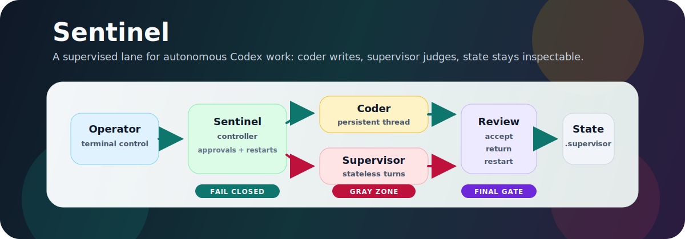
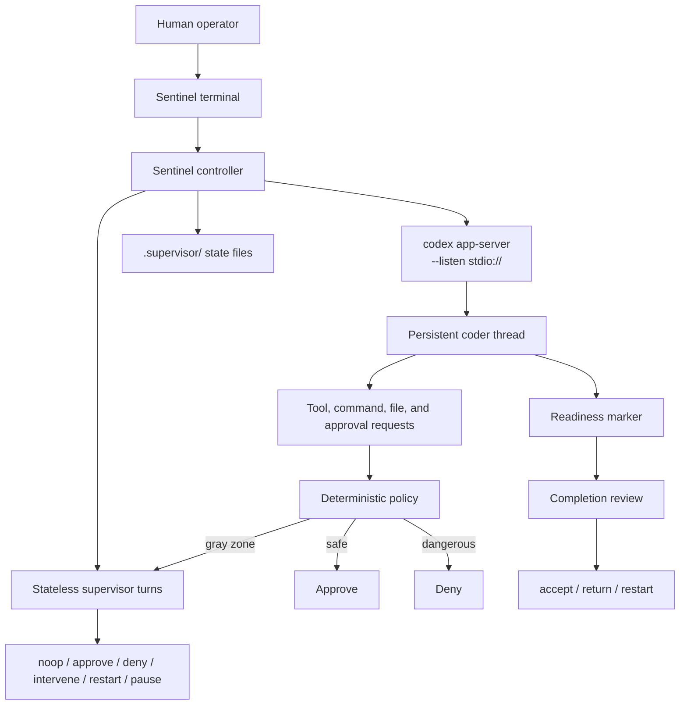

<h1 align="center">🛡️ Sentinel</h1>

<p align="center">
  <strong>Terminal supervision for autonomous Codex app-server runs.</strong><br>
  A persistent coder does the work. A separate supervisor owns approvals,
  steering, restarts, state, and final completion.
</p>

<p align="center">
  <a href="https://www.python.org/downloads/"></a>
  <a href="./LICENSE"></a>
  
  
</p>

<p align="center">
  
</p>

---

## ✨ What Sentinel Is

Sentinel is a terminal supervisor for autonomous Codex runs. It does not run
Codex through hooks, plugins, subagents, or `codex exec --json`. Instead,
Sentinel starts `codex app-server --listen stdio://` and controls Codex through
the app-server JSON-RPC protocol.

The goal is simple: let a Codex coding agent work autonomously while a separate
supervisor/controller owns approvals, steering, restarts, state, and final
completion.

| Surface | Sentinel's role |
| --- | --- |
| 🧑‍💻 Coder | A persistent Codex thread that reads the task file, edits code, runs commands, and validates the task. |
| 🧭 Supervisor | Short-lived stateless Codex turns that review compact runtime packets and return strict decisions. |
| 👤 Human | Talks to Sentinel, not directly to the coder. Normal approval prompts should not reach the human during a run. |
| 🗂️ State | Writes inspectable runtime files under `.supervisor/` in the target project. |

## 🚀 Quick Start

```bash
pipx install "git+https://github.com/Makson179/Sentinel.git"
sentinel doctor
sentinel config
sentinel --task TASK.md --coder-mod gpt-5.5 --super-mod gpt-5.5 --start-over
```

Useful companion commands:

```bash
sentinel --version
sentinel update
SENTINEL_SKIP_UPDATE_CHECK=1 sentinel --task TASK.md
```

## 🧠 Why Sentinel Exists

Full permissions are fast, but they also mean the same agent decides and
executes everything. Sentinel separates those roles so unattended work can keep
moving while risky actions stay controlled.

| Concern | Sentinel response |
| --- | --- |
| 🔎 Routine inspection | Safe read-only actions can be approved by deterministic policy. |
| ⛔ Dangerous actions | Secrets, broad deletes, permission changes, deploy/publish commands, git force operations, and supervisor-state edits are denied automatically. |
| ⚖️ Ambiguous actions | Gray-zone approvals are reviewed by a fresh stateless supervisor turn. |
| 🧵 Drift | The coder can be steered or restarted when it loses the thread. |
| 🏁 Final claims | Completion is accepted only by dedicated completion review. |
| 📜 Auditability | State and decisions are written to `.supervisor/` for inspection. |

This is designed for unattended work with controlled risk, not for perfect
safety or guaranteed correctness.

## 🗺️ Runtime Architecture



## 🧰 Command Reference

Command order rule: when combining pieces, keep the rows below in order. Earlier
rows belong before later rows.

| Piece | Use |
| --- | --- |
| `pipx install "git+https://github.com/Makson179/Sentinel.git"` | Install Sentinel from the default GitHub branch. |
| `SENTINEL_SKIP_UPDATE_CHECK=1` | Skip the startup update check for one command. |
| `sentinel` | Main command; run it from the project directory. |
| `config` | Open the interactive project config editor. |
| `doctor` | Check Python, Git, Codex, auth, app-server support, install metadata, and update status. |
| `update` | Update Sentinel, then use the updated install for future runs. |
| `--version` | Print Sentinel version, installed commit, and update status. |
| `-V` | Short form of `--version`. |
| `--help` | Show command help. |
| `-h` | Short form of `--help`. |
| `--task TASK.md` | Choose the markdown task file explicitly. |
| `--coder-mod MODEL` | Choose the Codex model for coder turns; must be used with `--super-mod`. |
| `--super-mod MODEL` | Choose the Codex model for supervisor turns; must be used with `--coder-mod`. |
| `--coder-intelligence VALUE` | Choose coder reasoning effort. |
| `--super-intelligence VALUE` | Choose supervisor reasoning effort. |
| <code>--fast[=true&#124;false]</code> | Use the Codex Fast service tier for both coder and full supervisor turns. |
| <code>--start-over[=true&#124;false]</code> | Reset `.supervisor` state and start fresh. |
| <code>--clean[=true&#124;false]</code> | Delete workspace files except the selected task file before starting; use only in disposable folders. |
| <code>--adversary[=true&#124;false]</code> | Run the adversarial tester before final completion. |
| `--adversary-runs N` | Override the adversarial tester pass limit for one run; `0` disables it. |
| `--protected-path PATH` | Mark a hidden or grading path as protected; repeat this option for multiple paths. |

Examples:

```bash
sentinel doctor
sentinel --version
sentinel update
sentinel config
sentinel --task TASK.md --coder-mod gpt-5 --super-mod gpt-5 --start-over
sentinel --task TASK.md --coder-mod gpt-5.5 --super-mod gpt-5.5
SENTINEL_SKIP_UPDATE_CHECK=1 sentinel --task TASK.md
```

## 🎛️ Model Selection

Sentinel resolves run settings by priority:

```text
explicit CLI flags -> .supervisor/config.json -> built-in defaults
```

Built-in defaults:

| Setting | Default |
| --- | --- |
| Coder model | `gpt-5.5` |
| Supervisor model | `gpt-5.5` |
| Coder intelligence | `xhigh` |
| Supervisor intelligence | `xhigh` |
| Speed | `usual` |
| Start over | `true` |
| Adversary | `true` |
| Max adversary runs | `1` |
| Max completion returns per generation | `10` |
| Clean | `false` |

Use `sentinel config` to edit project defaults for the current directory:

```bash
sentinel config
```

The config editor creates `.supervisor/config.json` if it does not exist and
saves values that future `sentinel` runs use when a CLI flag is omitted. It can
edit the task path, coder and supervisor models, reasoning effort, speed,
`start-over`, adversary enablement, adversary run limit, completion-return
limit, `clean`, and protected paths.

Choice fields expand in place with Enter. Free-text and numeric fields are typed
directly in the `VALUE` column and saved with Enter. CLI flags override saved
values for one run and do not rewrite the project config.

Choose models for a single run with:

```bash
sentinel --task TASK.md --coder-mod <coder-model> --super-mod <supervisor-model>
```

`--coder-mod` and `--super-mod` must be provided together. To use the same model
for both roles, pass the same value to both flags.

Add `--fast` or `--fast=true` to use the Codex Fast service tier for both coder
and full supervisor turns. Use `--fast=false` to override a fast project config
for one run.

For adversary settings, explicit `--adversary=true|false` wins. If
`--adversary` is omitted, `--adversary-runs N` overrides the saved run limit for
one run and also implies enabled when `N > 0` or disabled when `N = 0`.

Model names are Codex/OpenAI model slugs accepted by the installed Codex
app-server and the authenticated account. Use `gpt-5.5` for the default 5.5
model. Other usable values are the model slugs exposed to your account by
Codex; Sentinel passes them through unchanged and does not maintain a separate
hard-coded allow-list.

The adversarial tester always uses `gpt-5.5`, independent of `--coder-mod` or
`--super-mod`.

## 📺 Terminal Output

The terminal stream is chronological and lane-based:

```text
[SYSTEM] checking Codex version
[SYSTEM] checking Codex app-server schema
[SYSTEM] supervised coder started
[CODER] I will read the task file first.
[TOOL] command completed: cat TASK.md exit=0
[APPROVAL] accept: workspace file change inside workspace
[SUPERVISOR] steering coder: add focused validation before claiming completion
[SYSTEM] final report written: .supervisor/FINAL_REPORT.md
```

| Lane | Meaning |
| --- | --- |
| 🖥️ `[SYSTEM]` | Sentinel runtime state. |
| 👤 `[USER]` | Human input to Sentinel. |
| 🧭 `[SUPERVISOR]` | Supervisor decisions and steering. |
| 🧑‍💻 `[CODER]` | Completed coder messages. |
| 🛠️ `[TOOL]` | Completed tool, command, and file actions. |
| ✅ `[APPROVAL]` | Approved requests. |
| 🚫 `[DENIED]` | Declined or cancelled requests. |

## 🧪 Startup Preflight

Before starting the real coder, Sentinel checks:

| Check | Purpose |
| --- | --- |
| `codex --version` | Confirm Codex is available. |
| App-server schema generation | Confirm required protocol files and app-server support. |
| Codex account/auth state | Fail early when auth is missing. |
| Selected models | Confirm coder, supervisor, and adversarial tester models are available. |
| Account rate limits | Read limits when available. |
| Supervisor structured output | Confirm strict JSON can be produced. |
| Cheap approval triage | Optional structured-output probe when enabled. |
| App-server config requirements | Confirm the runtime can start correctly. |
| Coder sandbox and approval settings | Confirm requested execution constraints. |

If one of these fails, Sentinel exits before real work starts and records the
interruption in `.supervisor/FINAL_REPORT.md`.

## 📜 Runtime Contract

The coder receives an instruction like:

```text
You are the coding agent for this task.

Read the selected task file first:
<absolute task path>

Complete the task autonomously. When a command, file edit, network access,
MCP/app action, or other operation requires approval, request permission
through Codex's normal approval flow. Do not ask the human in chat.

When work is ready, include Summary, Validation, and the exact readiness marker
on its own line.

Use minimal changes. Prefer project conventions. Validate your work before
declaring readiness.
```

The supervisor does not keep a long chat history. Each supervisor decision gets
a compact packet containing:

- selected task contents;
- `PROGRESS.md`;
- `DECISIONS.md`;
- `LAST_ACTION.md`;
- `HEALTH.json`;
- `HANDOFF.md` when present;
- recent bounded events;
- current approval/action summary;
- current git diff summary;
- generation and restart count.

Runtime monitor decisions are strict JSON:

```text
noop | approve | deny | intervene | restart | pause
```

Completion review uses a separate strict schema:

```text
accept | return | restart
```

## 🧩 Prompt Configuration

All editable Sentinel prompt text lives in one TOML file:

```text
supervisor/prompts/prompts.toml
```

It contains:

- `coder_initial.template`;
- `coder_restart.template`;
- `stateless_supervisor.body_sections`;
- `stateless_supervisor.sections.*`.

The coder templates support the `{task_path}` placeholder. Sentinel loads this
file at runtime before building coder and supervisor turns.

For local experiments, point Sentinel at another prompt file:

```bash
SENTINEL_PROMPTS_FILE=/path/to/prompts.toml sentinel --task TASK.md
```

## ✅ Approvals

Codex app-server sends approval requests to Sentinel. Sentinel answers the exact
JSON-RPC server request id.

Deterministic policy handles obvious cases first:

| Route | Behavior |
| --- | --- |
| Safe project inspection | Approved automatically. |
| Known validation commands | Approved automatically. |
| Normal workspace file changes | Approved automatically. |
| Secrets, broad deletes, permission changes, deploy/publish commands, git force operations, supervisor-state edits | Denied automatically. |
| Gray-zone approvals | Sent to the stateless supervisor. |
| Supervisor timeout or invalid output | Fail closed with decline/cancel. |

When enabled, command approvals in a narrow gray zone can take a cheaper
mechanical review path before the full supervisor:

```text
deterministic policy
  -> allow or deny
  -> eligible composed read-only command
      -> cheap mechanical review
          -> approve_low_impact: plain accept
          -> escalate/failure/uncertainty: full supervisor
  -> all other gray-zone requests: full supervisor
  -> full-supervisor failure: decline/cancel
```

The cheap reviewer only classifies whether a command is bounded, operationally
read-only, workspace-local, and safe without task context. It cannot deny, grant
`acceptForSession`, amend policy, persist decisions, steer the coder, or resolve
file-change, network, permissions, tool, MCP, or unknown request types.

Its output is not included in the full-supervisor packet. On uncertainty or
failure, the full supervisor sees the same approval context and deterministic
routing reason it would have seen without cheap review.

Configure cheap approval triage independently from the full supervisor:

| Variable | Meaning |
| --- | --- |
| `SENTINEL_APPROVAL_TRIAGE_ENABLED=true` | Enables the optional fast path. |
| `SENTINEL_APPROVAL_TRIAGE_MODEL=<model>` | Selects the cheap reviewer model. Sentinel does not silently reuse the full supervisor model when this is missing. |
| `SENTINEL_APPROVAL_TRIAGE_TIMEOUT=<seconds>` | Sets the cheap-review timeout. |

Representative candidates:

- `git status --short && git diff --stat`;
- `git diff --name-only | head -n 20`;
- `find src -maxdepth 2 -type f | sort`;
- `cat pyproject.toml | head -n 80`.

Noncandidates:

- redirects;
- command or process substitution;
- network commands;
- interpreters such as `python -c`;
- dependency installation;
- git mutation;
- permission changes;
- destructive commands;
- secret paths;
- workspace escapes;
- unknown executables.

Unsupported app-server surfaces are fail-closed in the MVP:

- `thread/shellCommand`;
- `process/*`;
- dynamic tools;
- Computer Use / Browser Use;
- external app tools without a purpose-built `tool/requestUserInput` mapper.

## 🔁 Steering And Restarts

The supervisor can steer the coder with natural language.

If the coder turn is active, Sentinel sends `turn/steer` with the active
`expectedTurnId`. If the coder is idle, Sentinel starts a new turn on the same
coder thread.

Restart creates a new coder generation:

1. Interrupt active coder turn.
2. Resolve pending approvals.
3. Write `.supervisor/HANDOFF.md`.
4. Increment generation and restart count.
5. Start a fresh coder thread.
6. Tell the new coder to read task, decisions, progress, and handoff.

Default restart cap is 3. After that, Sentinel writes a stuck final report and
exits cleanly.

## 🗂️ State Files

Sentinel writes state under `.supervisor/` in the target project:

```text
.supervisor/
  config.json
  PROGRESS.md
  DECISIONS.md
  LAST_ACTION.md
  HEALTH.json
  HANDOFF.md
  FINAL_REPORT.md
  log.jsonl
  events.jsonl
```

Useful files:

| File | Purpose |
| --- | --- |
| `config.json` | Task path, coder and supervisor models, Codex version, schema hash, thread ids, generation. |
| `events.jsonl` | Normalized event stream. |
| `PROGRESS.md` | Supervisor progress notes. |
| `DECISIONS.md` | Persistent supervisor decisions. |
| `HANDOFF.md` | Restart handoff context. |
| `FINAL_REPORT.md` | Final result, changed files, validation, risks. |

## 🎮 Controls

Inside the terminal:

| Control | Action |
| --- | --- |
| `/status` | Show task, generation, active turn, pending approvals, health. |
| `/pause` | Interrupt coder and resolve pending approvals. |
| `/resume` | Resume autonomous loop. |
| `/restart` | Request supervised restart. |
| `/quit` | Write state and exit. |

Keyboard behavior:

| Key | Action |
| --- | --- |
| `Ctrl+C` | Pause or abort current terminal process. |
| `Ctrl+Q` | Clean exit when implemented by terminal. |

Human text is routed to the supervisor, not directly to the coder.

## 📄 License

Sentinel is released under the MIT License. See [LICENSE](./LICENSE).
