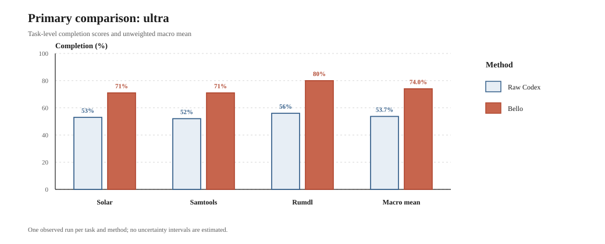
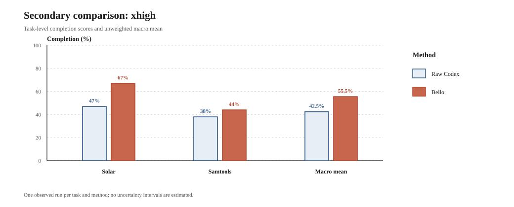
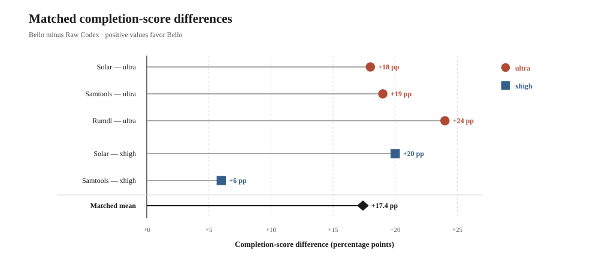
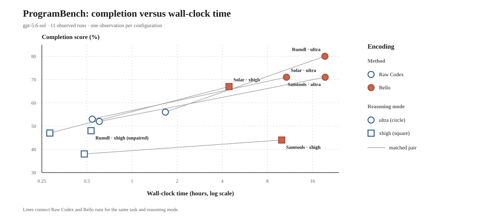

<h1 align="center">Bello</h1>

<p align="center">
  <strong>Walk away while an autonomous coding agent does the work, safely.</strong><br>
  A persistent Codex coder writes the code. A separate supervisor owns approvals,
  steering, restarts, and the final quality gate.
</p>

<p align="center">
  <a href="https://github.com/Makson179/Bello/actions/workflows/tests.yml"></a>
  <a href="https://www.python.org/downloads/"></a>
  <a href="./LICENSE"></a>
  
  
</p>

<p align="center">
  
</p>

---

# Motivation

Modern language models can write code, analyze documents, and solve complex problems, yet the model itself remains a generator of the next fragment of reasoning. When assigned a long, multi-stage task, it must simultaneously remember requirements, plan actions, execute them, assess its own progress, notice errors, and decide when the result can be considered complete.

Combining all these functions is unreliable. As the context grows, the model degrades very quickly and begins to hallucinate [[1]](https://aclanthology.org/2024.tacl-1.9/) [[2]](https://arxiv.org/abs/2404.06654) [[3]](https://aclanthology.org/2022.acl-long.229/) [[4]](https://aclanthology.org/2023.emnlp-main.397/). Compressing the history partly addresses the context-size problem, but it can lose a critical rule, decision, or prohibition. Meanwhile, a confident model response is not evidence that the task has actually been completed.

Bello moves the management of complex work to a level above the language model.

In our architecture, a single model is not expected to represent the entire thinking process. We treat a language model as a powerful but limited executor of cognitive operations. Planning the overall process, assigning roles, managing memory, evaluating effectiveness, and making the final decision about readiness should belong to a separate system.
Bello implements such a system: not a longer chain of reasoning from a single model, but a reproducible reasoning loop in which a solution is created, reviewed, attacked, corrected, and accepted only after independent confirmation.

## Cognitive foundations

Bello's architecture draws on several foundational areas of cognitive psychology.

In [Allen Newell and Herbert Simon's heuristic search model](https://books.google.com/books?id=h03uAAAAMAAJ), problem solving is viewed as moving from the current state to a goal state through a sequence of operations and subproblems. A person compares the current state with the desired one, chooses an action that reduces the difference, evaluates the result, and restructures the search if the chosen strategy does not work.

[Barry Zimmerman's research on self-regulated learning](https://doi.org/10.1207/S15430421TIP4102_2) describes activity as a recurring cycle of forethought, performance, and self-reflection. The outcome of an evaluation does not end the process; it changes the plan for the next attempt.

[Research on metacognition by John Flavell](https://doi.org/10.1037/0003-066X.34.10.906), [Thomas Nelson, Louis Narens](https://doi.org/10.1016/S0079-7421%2808%2960053-5), and other authors distinguishes between performing a task and managing that performance. One level solves the task; another observes the work in progress, evaluates confidence and evidence, and decides whether to continue, verify, change strategy, or stop.

Similar patterns have also been found in research on writing. [Linda Flower and John Hayes's model](https://doi.org/10.2307/356600) describes writing not as a linear sequence of “plan — draft — edit,” but as a recursive interaction between planning, translating ideas into text, and reviewing. A problem discovered while reading may require more than a local edit: it may call for returning to the goal, structure, or original intent.

The common principle behind this work is that producing a result, monitoring the process, and evaluating it critically should not collapse into a single indistinguishable operation. Reliable reasoning requires cycles, specialized functions, and the ability to revisit earlier decisions.

Bello turns this structure into an executable system.

## How Bello solves tasks

The process begins by building the first complete solution. The developer agent analyzes the task, modifies the project, runs checks, and creates a working prototype.

The result is then passed to **completion review**. This component does not continue development or take the author's report at face value. It independently reconstructs the task's mandatory requirements and checks:

* whether the required behavior has been implemented;
* whether the checks support the claimed result;
* whether any modes or edge cases remain untested;
* whether any regressions have been introduced;
* whether fresh validation was performed after the latest substantial changes.

If a problem is found, the work returns to the developer. After the fix, a new full review is performed because a local change may affect other parts of the system.

Once the solution has passed several development and review cycles, the **adversary** is launched. Its job is not to confirm the work, but to try to break it. It explores invalid inputs, unexpected action sequences, interactions between features, boundary states, and assumptions that the developer and reviewer may have overlooked.

The adversary works independently of the solution's development history. It evaluates the final artifact, not how convincing the author's explanation is. If it finds a potential defect, the solution is sent back to completion review, which determines whether the observed behavior is a genuine violation of the requirements.

Bello therefore implements the following cycle:

**build a solution → independently review completeness → fix defects → perform adversarial testing → reassess → accept the result.**

## Why this structure is a natural fit for software development

Software development demonstrates the limitations of single-pass reasoning particularly well.

A programmer initially builds an implementation around the core functionality. Even a strong first version may fail to account for rare inputs, error recovery, compatibility, operation order, or interactions between multiple components. It is also difficult for authors to evaluate their own code independently: they know what they intended to implement and therefore tend to mentally fill in what the program does not actually contain.

Completion review corresponds to rigorous code review and acceptance auditing. It evaluates the implementation's compliance with the requirements, not the elegance of its explanation. Passing a handful of visible tests is not considered sufficient if they do not cover the full required behavior.

The adversary corresponds to fuzzing, property-based testing, penetration testing, red teaming, and the work of an independent quality engineer. It does not seek confirmation of the standard scenario; it looks for conditions under which the system violates its contract.

Bello tracks not only the quality of the final code, but also the effectiveness of the development process. If the agent repeats the same mistakes, ignores feedback, loses sight of the original goal, or becomes stuck in a flawed interpretation, the system can stop the current line of work, preserve confirmed facts, and start a new pass with a clean context.

This separates the accumulated knowledge about the task from an individual agent's unsuccessful reasoning trajectory.

## The same structure in other forms of intellectual work

Similar cycles are used far beyond programming: in mathematics, scientific research, engineering, law, and strategic planning.

In all these fields, a reliable result emerges not from one long sequence of thoughts, but from the interaction between a creator, a reviewer, and a skeptic.

## Relationship to existing LLM research

Individual parts of this approach have already been tested in language-model research.

[**Self-Refine**](https://arxiv.org/abs/2303.17651) showed that a cycle of generation, critique, and refinement can substantially outperform a single-pass response. [**Reflexion**](https://arxiv.org/abs/2303.11366) demonstrated the value of retaining lessons from previous attempts. [**CRITIC**](https://arxiv.org/abs/2305.11738) connected self-correction with external tools and observable evidence. [Research on self-debugging](https://arxiv.org/abs/2304.05128) confirmed that models can improve code by analyzing execution results. [Work on adversarial testing and verifier-guided search](https://arxiv.org/abs/2604.10449) showed that a separate verifier or attacker can detect seemingly correct solutions that pass conventional checks.

These findings support individual elements of Bello's architecture. Most of this work, however, studies a single mechanism: reflection, correction, verification, debate, test generation, or adversarial search.

Bello combines these mechanisms into a unified system for managing long-running work.

## Results

### Key findings

- Bello achieved the higher completion score in **5 of 5 matched
  configurations**.
- Across those five comparisons, unweighted mean completion increased from
  **49.2% to 66.6%**: **+17.4 percentage points** (+35.4% relative).
- In the complete `ultra` comparison, every task improved by **18–24 points**,
  and the macro average increased from **53.7% to 74.0%**.

### Evaluation protocol

We evaluated Bello on three ProgramBench tasks: **Solar**, **Samtools**, and
**Rumdl**. The underlying model was held fixed at `gpt-5.6-sol`; the comparison
is between Raw Codex and Bello. We report the completion score recorded in
the `completion_pct` field and end-to-end wall-clock time from the `runtime`
field of the [run-level data](./programbench_run_info.csv).

The `ultra` setting is the primary comparison because it contains a matched Raw
Codex and Bello run for every task. The `xhigh` results are reported
separately: no Bello `xhigh` run was recorded for Rumdl. Runtime was not held
constant, so the comparison is not compute matched.

### Primary comparison: `ultra`

| Task | Raw Codex completion | Bello completion | Difference (pp) | Relative change | Raw Codex time | Bello time |
| --- | ---: | ---: | ---: | ---: | ---: | ---: |
| Solar | 53% | **71%** | **+18** | +34.0% | 00:32:33 | 10:43:00 |
| Samtools | 52% | **71%** | **+19** | +36.5% | 00:36:17 | 19:25:22 |
| Rumdl | 56% | **80%** | **+24** | +42.9% | 01:40:05 | 19:20:30 |
| **Macro mean / total time** | 53.7% | **74.0%** | **+20.3** | **+37.9%** | **02:48:55** | **49:28:52** |

*Bold completion values indicate the higher observed score within each matched
row.*

Across the three matched `ultra` runs, Bello increased completion by
18–24 percentage points on every task. The unweighted macro average rose from
53.7% to 74.0%, a gain of 20.3 points (37.9% relative).

### Secondary comparison: `xhigh`

| Task | Raw Codex completion | Bello completion | Difference (pp) | Relative change | Raw Codex time | Bello time |
| --- | ---: | ---: | ---: | ---: | ---: | ---: |
| Solar | 47% | **67%** | **+20** | +42.6% | 00:16:58 | 04:26:04 |
| Samtools | 38% | **44%** | **+6** | +15.8% | 00:28:48 | 09:57:52 |
| Rumdl | 48% | — | — | — | 00:31:57 | — |

*Bold completion values indicate the higher observed score within each matched
row; Rumdl `xhigh` has no matched Bello observation.*

The available `xhigh` pairs are directionally positive but heterogeneous:
Solar gained 20 points, whereas Samtools gained 6. Across these two matched
tasks, the unweighted macro average increased from 42.5% to 55.5% (+13.0
points, +30.6% relative). Rumdl is excluded from this aggregate rather than
treated as a zero or imputed result.

### Cross-task completion summary



*Figure 1. Completion scores for the complete `ultra` comparison. Bello
outperformed Raw Codex on all three tasks; the unweighted macro average
increased by 20.3 percentage points.*



*Figure 2. Completion scores for the matched `xhigh` comparison. Rumdl is
excluded because no Bello `xhigh` run was recorded. Across Solar and
Samtools, the unweighted macro average increased from 42.5% to 55.5%
(+13.0 percentage points).*

### Matched effect sizes



*Figure 3. Bello-minus-Raw completion differences for all five available
matched configurations. Every point lies to the right of zero. The diamond
shows the unweighted matched mean (+17.4 points); uncertainty intervals are not
shown because each configuration has one observation.*

### Completion–runtime overview



*Figure 4. Completion score versus wall-clock time for all 11 recorded runs.
Marker color denotes the method, marker shape denotes the reasoning mode, and
gray segments connect matched Raw Codex and Bello configurations. The legend
is placed outside the plotting region; wall-clock time is shown on a logarithmic
axis.*

## Requirements

- **Codex CLI** installed and authenticated (Bello drives
  `codex app-server`; your Codex account provides the models).
- **Python 3.11+** and **git**.
- macOS or Linux.

Verify your environment at any time with `bello doctor`.

## Install

**Option A: Codex plugin** (recommended if you work inside Codex):

```bash
pipx install bello
codex plugin marketplace add AlexeyKulaev/Bello-codex-marketplace --ref main
codex plugin add bello@bello-marketplace
```

Then open Codex in your project folder and ask it to run Bello on your task
file. The plugin checks for updates and launches the run for you.

**Option B: standalone CLI**

```bash
pipx install bello
bello doctor
```

Bello checks for updates at startup and offers to install them; run
`bello update` to update explicitly.

## Context Mode (opt-in beta)

Context Mode is an experimental coder-only mode that reduces and indexes large
local results before they enter the model context. It is disabled by default.
Enable it with `--context-mode`; `--no-context-mode` disables it explicitly.
Startup fails if a verified bundle for the host platform is unavailable. Bello
does not download, install, or repair Context Mode dependencies at runtime.

The coder receives exactly eight Context Mode tools:

- `ctx_execute`, `ctx_execute_file`, and `ctx_batch_execute` for approved local
  execution and bounded result processing.
- `ctx_index` and `ctx_search` for the current disposable workspace index.
- `ctx_stats` and `ctx_doctor` for bounded status and health checks.
- `ctx_purge` for an explicitly approved state reset.

The currently provisioned target is Linux x86-64. Its bundle contains pinned
Node.js 22.5.0, the Bello offline worker and dependencies, and an
Ed25519-signed broker/launcher authority. The Linux bundle and authority are
verified against repository release pins before use. Linux ARM64 and both
macOS records are not currently provisioned and are not runnable release
targets.

Large output can be reduced to a bounded result and retained in run-local
SQLite for later `ctx_search`. Execution tools use Bello's approval flow;
`ctx_purge` requires a separate explicit approval. On Linux, startup runs the
signed authority's bubblewrap/seccomp self-test and launches the worker with an
offline environment and network-socket denial. The coder and supervisor Codex
app-server processes retain the provider connection they need. This beta
description covers only properties checked by the bundle verifier and native
self-test; it is not a claim of a complete third-party security audit.

The adapter contract is pinned to `codex-cli 0.146.0` and to the canonical
SHA-256 of that release's generated app-server schema. Startup rejects a
different CLI, schema, or MCP approval-correlation surface before any coder
turn.

Startup fails closed before the first coder turn if the platform bundle is
missing or unsupported, its canonical manifest/hash coverage or offline-fork
attestation is invalid, the native backend or sandbox is unavailable, or the
effective catalogue differs from the pinned policy. Source files and release
pins alone are insufficient: a runnable installation must include the
generated platform bundle under `supervisor/_vendor/context_mode`.

By default Bello removes run-local Context Mode state after all writers stop.
`--keep-context-mode-data` retains that external run directory for diagnostics;
it does not put Context Mode state into the project. Retained indexes and
diagnostics can reflect project and task data, so protect and delete them when
they are no longer needed. `--context-mode-debug` adds bounded, redacted
lifecycle diagnostics and never intentionally records raw tool payloads.

## Quick start

```bash
cd your-project
echo "Build a CLI tool that ..." > task.md
bello --task task.md
```

That's it. Bello starts the coder, supervises the run, and writes
`.supervisor/FINAL_REPORT.md` when it finishes: status, changed files,
validations that were run, and remaining risks.

While a run is active you can type into the terminal; your message is routed
to the supervisor, not the coder:

| Control | Action |
| --- | --- |
| `/status` | Show task, generation, active turn, pending approvals, health. |
| `/pause` / `/resume` | Pause and resume the autonomous loop. |
| `/restart` | Request a supervised restart. |
| `/quit` | Write state and exit. |
| any text | Delivered to the supervisor as an instruction or constraint. |

Everything the run does is written to inspectable files under `.supervisor/`
in your project: `PROGRESS.md` (what has happened), `DECISIONS.md` (standing
decisions), `HANDOFF.md` (restart context), `events.jsonl` (full event
stream), and `FINAL_REPORT.md` (the result).

## Run modes

Both primary modes keep the coder inside Bello's sandbox and retain runtime
supervision, approval checks, steering, and restart recovery. They differ in
what happens after the coder reports validated readiness.

### Everyday (default)

Everyday is for short and medium tasks. A fresh project uses GPT-5.6 Sol at
`xhigh` for both the coder and full runtime supervisor, with Luna handling
routine cheap runtime triage. Completion review and the adversary are off.

```bash
bello --task task.md
```

The run finishes once the coder's readiness passes Bello's required
validation gates. Runtime supervision remains active throughout the run; only
the final review loop is skipped.

### Deep Work

Deep Work is for long, demanding tasks with many details and edge cases, where
quality takes priority over time and cost. It adds an independent completion
reviewer and an adversarial tester, both GPT-5.6 Sol at `xhigh` by default.

The default Deep Work schedule is `4 + 1 + 2`:

- Up to 4 completion-review returns before the adversary.
- 1 adversary pass in a disposable snapshot.
- Up to 2 additional completion-review returns after the adversary.

These are maximum return budgets, not mandatory calls. An earlier completion
accept or an adversary pass with no candidate finding can finish the run
sooner.

To enable Deep Work, run `bello config`, set `completion-review` to `true`,
then set `adversary` to `true`. The revealed review limits default to `4`, `1`,
and `2`. For a single run without rewriting the saved config:

```bash
bello --task task.md --completion-review=true --adversary=true
```

### Custom

For experiments, configure the coder, runtime supervisor, completion reviewer,
and adversary independently. Each role can use any available GPT-5.6 variant
and its own reasoning effort, and the review and adversary budgets can be
combined freely.

## Configuration

Open the interactive editor from your project folder:

```bash
bello config
```

It creates and edits `.supervisor/config.json`. Every value is saved as you
press Enter; future runs in this folder use these settings automatically.

The editor starts in Everyday mode for a new project and only shows settings
that can affect the selected pipeline. Turning on `completion-review` reveals
the completion reviewer and review budget. Turning on `adversary` then reveals
the adversary model and the complete `4 + 1 + 2` schedule.

For each visible role, select GPT-5.6 and then choose Sol, Terra, or Luna in
the variant row. Sol and Terra support reasoning effort from `low` through
`ultra`; Luna supports `low` through `max`. Active primary roles default to
GPT-5.6 Sol at `xhigh`; cheap runtime triage uses Luna.

CLI flags override their corresponding saved settings for one run and never
rewrite the project config. Settings without a CLI flag, including cheap
runtime and review budgets, are changed through `bello config`.

| Setting | Default | What it does |
| --- | --- | --- |
| `task` | absent | Default task file for this folder. When set, plain `bello` runs it; `--task` always overrides. |
| `coder-mod` | GPT-5.6 | Model family for the coder thread. |
| `coder-5.6-variant` | Sol | GPT-5.6 variant for the coder: Sol, Terra, or Luna. |
| `coder-intelligence` | `xhigh` | Coder reasoning effort, limited by the selected variant. |
| `runtime-mod` | GPT-5.6 | Model family for fresh-context runtime checks, including risky-action judgment and drift detection. |
| `runtime-5.6-variant` | Sol | GPT-5.6 variant for the full runtime supervisor. |
| `runtime-intelligence` | `xhigh` | Full runtime supervisor reasoning effort. |
| `completion-mod` | GPT-5.6 | Model family for the independent read-only completion reviewer. Hidden in Everyday mode. |
| `completion-5.6-variant` | Sol | GPT-5.6 variant for completion review. Hidden in Everyday mode. |
| `completion-intelligence` | `xhigh` | Completion reviewer reasoning effort. Hidden in Everyday mode. |
| `adversary-mod` | GPT-5.6 | Adversarial tester model family. Visible only when the adversary is enabled. |
| `adversary-5.6-variant` | Sol | GPT-5.6 variant for the adversary. Visible only when the adversary is enabled. |
| `adversary-intelligence` | `xhigh` | Adversary reasoning effort. Visible only when the adversary is enabled. |
| `speed` | `usual` | `fast` uses the Codex Fast service tier for coder, runtime-supervisor, and completion-review turns. Adversary turns are unchanged. |
| `cheap-runtime` | `true` | Let Luna dismiss routine runtime checks before invoking the full runtime supervisor. Human messages, approvals, and mandatory checks bypass triage. |
| `structured-code-tools` | `off` | `off` exposes no structured code tools. `read` exposes `list_symbols`, `read_symbol`, `find_references`, and `read_raw`. `preview` exposes those reads plus `prepare_symbol_edit`, which validates and returns a patch preview but never writes. This setting can be used together with Context Mode; the two tool surfaces remain independent. |
| `start-over` | `true` | `true` removes prior Bello logs, archived runs, and recovery data; `false` preserves them. Both start fresh active state and leave project files unchanged. |
| `context-mode` | `false` | Opt in to the bundled coder-only offline Context Mode beta. Startup fails closed when its platform bundle or security gates are unavailable. |
| `completion-review` | `false` | `false` is Everyday. `true` enables the independent completion-review loop and reveals its settings. |
| `adversary` | `false` | Enable the adversarial tester before completion. Requires completion review. |
| `max-reviews` / `max-reviews-before-adversary` | `4` | Completion-return budget. Without an adversary it is shown as `max-reviews`; with an adversary it limits returns before the first pass. An earlier accept starts the adversary immediately; `0` is unlimited. |
| `max-adversary-runs` | `1` | Maximum adversary passes in Deep Work. `0` disables the adversary. |
| `max-reviews-after-adversary` | `2` | Maximum completion-review returns after each adversary pass. At the limit Bello starts the next pass or completes after the final one; `0` is unlimited. |
| `clean` | `false` | **Warning:** deletes **everything** in the folder except the task file and configured protected paths before starting. Only for disposable folders where you want a from-scratch build. |
| `protected-path` | absent | Paths the coder must never write to, such as golden tests, fixtures, or production configs. They are also preserved by `clean`. |

Structured-code failures are aggregated in `.supervisor/runtime_metrics.json` by
allowlisted error code, machine reason, and tool. The diagnostics never retain
arguments, paths, source content, cursors, hashes, or human-readable error text.

## Command reference

```bash
bello                 # run the configured task in the current folder
bello --task TASK.md  # run a specific task file
bello config          # open the interactive config editor
bello doctor          # check Python, git, Codex, auth, app-server support
bello update          # update Bello to the latest version
bello update --check --json  # machine-readable update status
bello --version       # installed version, latest version, update status
```

Run flags (each overrides the saved config for one run):

| Flag | Meaning |
| --- | --- |
| `--task PATH` | Task file to run. |
| `--coder-mod M` | Coder model. |
| `--runtime-mod M` | Runtime supervisor model. |
| `--completion-mod M` | Completion reviewer model. |
| `--adversary-mod M` | Adversarial tester model. |
| `--coder-intelligence V` | Coder reasoning effort. |
| `--runtime-intelligence V` | Runtime supervisor reasoning effort. |
| `--completion-intelligence V` | Completion reviewer reasoning effort. |
| `--adversary-intelligence V` | Adversarial tester reasoning effort. |
| <code>--fast[=true&#124;false]</code> | Codex Fast service tier. |
| <code>--start-over[=true&#124;false]</code> | Fresh `.supervisor/` state. |
| `--structured-code-tools off\|read\|preview` | Override the structured code tool surface for one run. `preview` only previews symbol edits; it never applies them. |
| `--context-mode` / `--no-context-mode` | Enable the coder-only offline beta or force the emergency fallback off. |
| `--keep-context-mode-data` | Retain external run-local Context Mode state after shutdown for diagnostics. |
| `--context-mode-debug` | Emit bounded, redacted Context Mode lifecycle diagnostics. |
| <code>--completion-review[=true&#124;false]</code> | Completion-review loop on/off (`false` = Everyday and disables the adversary). |
| <code>--adversary[=true&#124;false]</code> | Adversarial tester on/off. |
| `--adversary-runs N` | Adversary pass budget; `0` disables. |
| <code>--clean[=true&#124;false]</code> | **Warning:** wipe the folder except the task file and protected paths before starting. |
| `--protected-path PATH` | Protect a path from writes; repeat for multiple paths. |

Environment variables: `BELLO_SKIP_UPDATE_CHECK=1` skips the startup update
check; `BELLO_PROMPTS_FILE=/path/to/prompts.toml` points Bello at an
alternative prompt file for experiments; `BELLO_CONFIG_ANIMATIONS=0`
disables motion in the interactive config editor.

## License

Bello is released under the MIT License. See [LICENSE](./LICENSE). Platform
wheels that include Bello's pinned Context Mode offline fork also carry its
Elastic License 2.0 notice and the licenses for the bundled Node runtime and
dependencies.

Contributions require signing the project [CLA](./CLA.md); a bot will prompt
you on your first pull request, and you only sign once.
