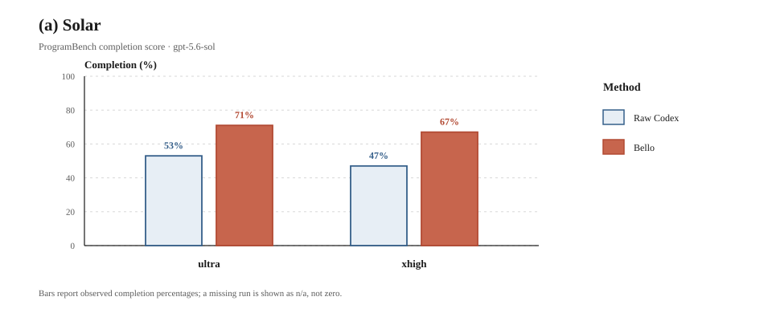
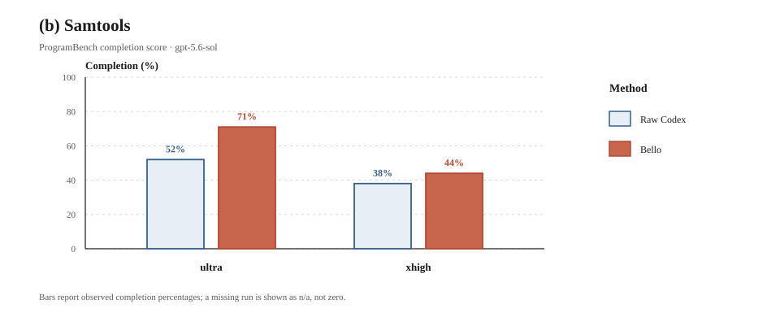
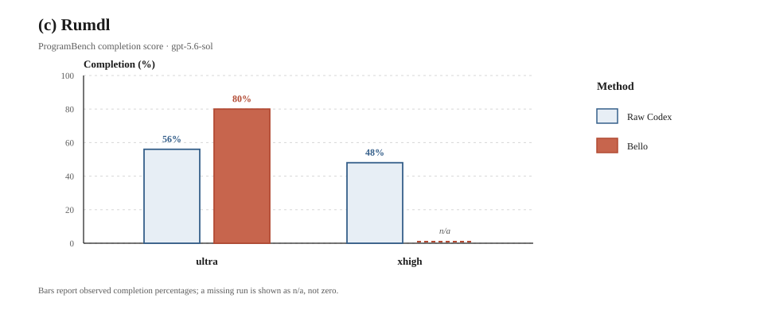

<h1 align="center">Bello</h1>

<p align="center">
  <strong>Simple setup, clear configuration, fully autonomous execution, and safety by design.</strong><br>
  Assign the task and walk away. Bello keeps the coder inside a disposable
  sandbox while an independent, fresh-context supervisor reviews risky actions,
  catches drift, and manages recovery.<br>
  Across three public ProgramBench tasks and three model-effort settings, Bello
  outperformed Raw Codex in all 9 matched comparisons, increasing average
  completion from 44.87% to 61.21%. It is ready to take on your most demanding
  tasks.
</p>

<p align="center">
  <a href="https://github.com/Makson179/Bello/actions/workflows/tests.yml"></a>
  <a href="https://www.python.org/downloads/"></a>
  <a href="./LICENSE"></a>
  
  
</p>

<p align="center">
  
</p>

---

# Motivation

Modern language models can write code, analyze documents, and solve complex problems, yet the model itself remains a generator of the next fragment of reasoning. When assigned a long, multi-stage task, it must simultaneously remember requirements, plan actions, execute them, assess its own progress, notice errors, and decide when the result can be considered complete.

Combining all these functions is unreliable. As the context grows, the model degrades very quickly and begins to hallucinate [[1]](https://aclanthology.org/2024.tacl-1.9/) [[2]](https://arxiv.org/abs/2404.06654) [[3]](https://aclanthology.org/2022.acl-long.229/) [[4]](https://aclanthology.org/2023.emnlp-main.397/). Compressing the history partly addresses the context-size problem, but it can lose a critical rule, decision, or prohibition. Meanwhile, a confident model response is not evidence that the task has actually been completed.

Bello moves the management of complex work to a level above the language model.

In our architecture, a single model is not expected to represent the entire thinking process. We treat a language model as a powerful but limited executor of cognitive operations. Planning the overall process, assigning roles, managing memory, evaluating effectiveness, and making the final decision about readiness should belong to a separate system.
Bello implements such a system: not a longer chain of reasoning from a single model, but a reproducible reasoning loop in which a solution is created, reviewed, attacked, corrected, and accepted only after independent confirmation.

## Cognitive foundations

Bello's architecture draws on several foundational areas of cognitive psychology.

In [Allen Newell and Herbert Simon's heuristic search model](https://books.google.com/books?id=h03uAAAAMAAJ), problem solving is viewed as moving from the current state to a goal state through a sequence of operations and subproblems. A person compares the current state with the desired one, chooses an action that reduces the difference, evaluates the result, and restructures the search if the chosen strategy does not work.

[Barry Zimmerman's research on self-regulated learning](https://doi.org/10.1207/S15430421TIP4102_2) describes activity as a recurring cycle of forethought, performance, and self-reflection. The outcome of an evaluation does not end the process; it changes the plan for the next attempt.

[Research on metacognition by John Flavell](https://doi.org/10.1037/0003-066X.34.10.906), [Thomas Nelson, Louis Narens](https://doi.org/10.1016/S0079-7421%2808%2960053-5), and other authors distinguishes between performing a task and managing that performance. One level solves the task; another observes the work in progress, evaluates confidence and evidence, and decides whether to continue, verify, change strategy, or stop.

Similar patterns have also been found in research on writing. [Linda Flower and John Hayes's model](https://doi.org/10.2307/356600) describes writing not as a linear sequence of “plan — draft — edit,” but as a recursive interaction between planning, translating ideas into text, and reviewing. A problem discovered while reading may require more than a local edit: it may call for returning to the goal, structure, or original intent.

The common principle behind this work is that producing a result, monitoring the process, and evaluating it critically should not collapse into a single indistinguishable operation. Reliable reasoning requires cycles, specialized functions, and the ability to revisit earlier decisions.

Bello turns this structure into an executable system.

## How Bello solves tasks

The process begins by building the first complete solution. The developer agent analyzes the task, modifies the project, runs checks, and creates a working prototype.

The result is then passed to **completion review**. This component does not continue development or take the author's report at face value. It independently reconstructs the task's mandatory requirements and checks:

* whether the required behavior has been implemented;
* whether the checks support the claimed result;
* whether any modes or edge cases remain untested;
* whether any regressions have been introduced;
* whether fresh validation was performed after the latest substantial changes.

If a problem is found, the work returns to the developer. After the fix, a new full review is performed because a local change may affect other parts of the system.

Once the solution has passed several development and review cycles, the **adversary** is launched. Its job is not to confirm the work, but to try to break it. It explores invalid inputs, unexpected action sequences, interactions between features, boundary states, and assumptions that the developer and reviewer may have overlooked.

The adversary works independently of the solution's development history. It evaluates the final artifact, not how convincing the author's explanation is. Its raw report then goes through a narrow report controller: supported findings are retained, unsupported ones are rejected or downgraded under a strict boundary, and all concrete observations are carried forward. Only normalized findings and observations reach the developer.

Bello therefore implements the following cycle:

**build a solution → independently review completeness → fix defects → perform adversarial testing → reassess → accept the result.**

## Why this structure is a natural fit for software development

Software development demonstrates the limitations of single-pass reasoning particularly well.

A programmer initially builds an implementation around the core functionality. Even a strong first version may fail to account for rare inputs, error recovery, compatibility, operation order, or interactions between multiple components. It is also difficult for authors to evaluate their own code independently: they know what they intended to implement and therefore tend to mentally fill in what the program does not actually contain.

Completion review corresponds to rigorous code review and acceptance auditing. It evaluates the implementation's compliance with the requirements, not the elegance of its explanation. Passing a handful of visible tests is not considered sufficient if they do not cover the full required behavior.

The adversary corresponds to fuzzing, property-based testing, penetration testing, red teaming, and the work of an independent quality engineer. It does not seek confirmation of the standard scenario; it looks for conditions under which the system violates its contract.

Bello tracks not only the quality of the final code, but also the effectiveness of the development process. If the agent repeats the same mistakes, ignores feedback, loses sight of the original goal, or becomes stuck in a flawed interpretation, the system can stop the current line of work, preserve confirmed facts, and start a new pass with a clean context.

This separates the accumulated knowledge about the task from an individual agent's unsuccessful reasoning trajectory.

## The same structure in other forms of intellectual work

Similar cycles are used far beyond programming: in mathematics, scientific research, engineering, law, and strategic planning.

In all these fields, a reliable result emerges not from one long sequence of thoughts, but from the interaction between a creator, a reviewer, and a skeptic.

## Relationship to existing LLM research

Individual parts of this approach have already been tested in language-model research.

[**Self-Refine**](https://arxiv.org/abs/2303.17651) showed that a cycle of generation, critique, and refinement can substantially outperform a single-pass response. [**Reflexion**](https://arxiv.org/abs/2303.11366) demonstrated the value of retaining lessons from previous attempts. [**CRITIC**](https://arxiv.org/abs/2305.11738) connected self-correction with external tools and observable evidence. [Research on self-debugging](https://arxiv.org/abs/2304.05128) confirmed that models can improve code by analyzing execution results. [Work on adversarial testing and verifier-guided search](https://arxiv.org/abs/2604.10449) showed that a separate verifier or attacker can detect seemingly correct solutions that pass conventional checks.

These findings support individual elements of Bello's architecture. Most of this work, however, studies a single mechanism: reflection, correction, verification, debate, test generation, or adversarial search.

Bello combines these mechanisms into a unified system for managing long-running work.

## Results

### Key findings

- Across all three tasks and model–effort settings, Bello achieved the higher
  completion score in **9 of 9 matched configurations**. The overall unweighted
  mean increased from **44.87% to 61.21%**: **+16.33 percentage points**
  (+36.40% relative).
- With GPT-5.6 Sol, Bello achieved the higher completion score in **6 of 6
  matched configurations**. The unweighted mean increased from **48.92% to
  67.04%**: **+18.13 percentage points** (+37.06% relative).
- In the complete GPT-5.6 Sol `ultra` comparison, every task improved by
  **18.17–24.59 points**, and the macro average increased from **53.53% to 74.03%**.
- With GPT-5.5 `xhigh`, Bello scored higher on all three tasks; the macro
  average increased from **36.79% to 49.53%**: **+12.74 percentage points**
  (+34.64% relative).

### Evaluation protocol

We evaluated Bello on three ProgramBench tasks: **Solar**, **Samtools**, and
**Rumdl**. Raw Codex and Bello were observed on every task with GPT-5.6 Sol in
both `ultra` and `xhigh` modes and with GPT-5.5 in `xhigh` mode. We report the
completion score recorded in the `completion_pct` field and time from the
`runtime` field of the [run-level data](./programbench_run_info.csv).
Completion scores are rounded to the nearest hundredth of a percentage point.
Runtime was not held constant, so the comparison is not compute matched.
The final solution patches for all nine reported Bello runs, together with
SHA-256 checksums, are available in the
[public evaluation artifacts folder](https://drive.google.com/drive/folders/1MSyxidKXeQz7DA0gKn6KJtcWmefFu2-D?usp=share_link).

### GPT-5.6 Sol

#### `ultra`

| Task | Raw Codex completion | Bello completion | Difference (pp) | Relative change | Raw Codex time | Bello time |
| --- | ---: | ---: | ---: | ---: | ---: | ---: |
| Solar | 53.13% | **71.30%** | **+18.17** | +34.20% | 00:32:33 | 07:39:17 |
| Samtools | 51.86% | **70.60%** | **+18.74** | +36.14% | 00:36:17 | 19:25:22 |
| Rumdl | 55.60% | **80.19%** | **+24.59** | +44.23% | 01:40:05 | 07:44:12 |
| **Macro mean / total time** | 53.53% | **74.03%** | **+20.50** | **+38.30%** | **02:48:55** | **34:48:51** |

*Bold completion values indicate the higher observed score within each matched
row.*

Across the three matched `ultra` runs, Bello increased completion by
18.17–24.59 percentage points on every task. The unweighted macro average rose
from 53.53% to 74.03%, a gain of 20.50 points (38.30% relative).


*Figure 1a. Bello-minus-Raw completion differences for the three GPT-5.6 Sol
`ultra` configurations. Every point lies to the right of zero; the diamond
shows the unweighted mean difference (+20.50 points). Uncertainty intervals are
not shown because each configuration has one observation.*

#### `xhigh`

| Task | Raw Codex completion | Bello completion | Difference (pp) | Relative change | Raw Codex time | Bello time |
| --- | ---: | ---: | ---: | ---: | ---: | ---: |
| Solar | 46.61% | **66.50%** | **+19.89** | +42.67% | 00:16:58 | 04:26:04 |
| Samtools | 38.11% | **51.93%** | **+13.82** | +36.26% | 00:28:48 | 05:39:13 |
| Rumdl | 48.19% | **61.74%** | **+13.55** | +28.12% | 00:31:57 | 03:53:35 |
| **Macro mean / total time** | 44.30% | **60.06%** | **+15.75** | **+35.56%** | **01:17:43** | **13:58:52** |

*Bold completion values indicate the higher observed score within each matched
row.*

All three `xhigh` tasks improved. The gains ranged from 13.55 to 19.89 percentage
points, and the unweighted macro average increased from 44.30% to 60.06%
(+15.75 points, +35.56% relative).


*Figure 1b. Bello-minus-Raw completion differences for the three GPT-5.6 Sol
`xhigh` configurations. Every point lies to the right of zero; the diamond
shows the unweighted mean difference (+15.75 points). Uncertainty intervals are
not shown because each configuration has one observation.*

### GPT-5.5

#### `xhigh`

| Task | Raw Codex completion | Bello completion | Difference (pp) | Relative change | Raw Codex time | Bello time |
| --- | ---: | ---: | ---: | ---: | ---: | ---: |
| Solar | 43.78% | **53.39%** | **+9.61** | +21.95% | 00:16:27 | 01:29:35 |
| Samtools | 20.28% | **44.21%** | **+23.93** | +118.00% | 00:16:28 | 02:30:01 |
| Rumdl | 46.30% | **50.99%** | **+4.69** | +10.13% | 00:26:03 | 03:30:01 |
| **Macro mean / total time** | 36.79% | **49.53%** | **+12.74** | **+34.64%** | **00:58:58** | **07:29:37** |

*Bold completion values indicate the higher observed score within each matched
row.*

Bello's score was higher on all three tasks. The task-level differences ranged
from 4.69 to 23.93 percentage points; the unweighted macro average increased
from 36.79% to 49.53%, a gain of 12.74 points (34.64% relative).

### Cross-task completion summary


*Figure 2. Cross-task completion summary on a common 0–100% scale. Panels
(a), (b), and (c) show the matched GPT-5.6 Sol `ultra`, GPT-5.6 Sol `xhigh`,
and GPT-5.5 `xhigh` comparisons. The unweighted macro differences are +20.50,
+15.75, and +12.74 percentage points, respectively.*

### Task-level configuration profiles

The following panels compare all three complete three-task configurations:
GPT-5.5 `xhigh`, GPT-5.6 Sol `xhigh`, and GPT-5.6 Sol `ultra`. Each panel
contains exactly six bars (Raw Codex and Bello for each model–effort setting),
ordered by increasing completion score. Bello precedes Raw Codex when scores
are tied. Ordering is descriptive and does not imply compute equivalence.



*Figure 3a. Solar completion scores for the six model–effort configurations,
sorted from lowest to highest. The two formerly tied values are shown at their
available precision: Codex GPT-5.6 Sol `ultra` at 53.13% and Bello GPT-5.5
`xhigh` at 53.39%.*



*Figure 3b. Samtools completion scores for the six model–effort
configurations, sorted from lowest to highest.*



*Figure 3c. Rumdl completion scores for the six model–effort
configurations, sorted from lowest to highest.*

### A shorter quality–efficiency balance

We also tested a shorter `C+A+C` schedule: it reached 63% completion on
Samtools and 79% on Rumdl. Each completion-review or adversary pass is designed
to find every material defect it can in the solution snapshot it receives, so
each successive pass tends to deliver a smaller quality gain at roughly the
same per-pass cost. The `C+A+C` results, together with an intermediate run in
which the first two completion reviews delivered roughly 80% of the eventual
improvement, support this diminishing-returns pattern. We therefore recommend
`C+A`—one completion review followed by one adversary pass—as the best balance
of quality, time, and cost. We expect it to retain about 60–70% of the full
schedule's quality gain: against the roughly 35% average relative improvement
observed above, that corresponds to an estimated gain of about 20% over Raw
Codex.

Time and cost remain limitations. We estimate that `C+A` takes approximately
2.5× as long as Raw Codex and costs approximately 2.7× as much. The absolute
impact is much smaller than those multipliers suggest: in our observed `ultra`
runs, Raw Codex used about 0.2–0.3% of a weekly usage limit on a substantial
task, while `C+A+C` used at most about 1.2%. In economic terms, the
share of the available budget matters alongside the relative increase: tripling
a negligible expense is less noticeable than a 5% increase in something that
already consumes half the budget. We are actively working to reduce both
runtime and cost without giving up the quality improvement.

## Requirements

- **Codex CLI** installed and authenticated (Bello drives
  `codex app-server`; your Codex account provides the models).
- **Python 3.11+** and **git**.
- macOS or Linux.

Verify your environment at any time with `bello doctor`.

## Install

**Option A: Codex plugin** (recommended if you work inside Codex):

```bash
pipx install bello
codex plugin marketplace add AlexeyKulaev/Bello-codex-marketplace --ref main
codex plugin add bello@bello-marketplace
```

Then open Codex in your project folder and ask it to run Bello on your task
file. The plugin checks for updates and launches the run for you.

**Option B: standalone CLI**

```bash
pipx install bello
bello doctor
```

Bello checks for updates at startup and offers to install them; run
`bello update` to update explicitly.

## Quick start

```bash
cd your-project
echo "Build a CLI tool that ..." > task.md
bello --task task.md
```

That's it. Bello starts the coder, supervises the run, and writes
`.supervisor/FINAL_REPORT.md` when it finishes: status, changed files,
validations that were run, and remaining risks.

While a run is active you can type into the terminal; your message is routed
to the supervisor, not the coder:

| Control | Action |
| --- | --- |
| `/status` | Show task, generation, active turn, pending approvals, health. |
| `/pause` / `/resume` | Pause and resume the autonomous loop. |
| `/restart` | Request a supervised restart. |
| `/quit` | Write state and exit. |
| any text | Delivered to the supervisor as an instruction or constraint. |

Everything the run does is written to inspectable files under `.supervisor/`
in your project: `PROGRESS.md` (what has happened), `DECISIONS.md` (standing
decisions), `HANDOFF.md` (restart context), `events.jsonl` (full event
stream), `coder/CHECKLIST.md` (the coder's mutable behavior map), and
`FINAL_REPORT.md` (the result). The checklist is coder-owned working memory;
it is never part of the submitted product or treated by reviewers as proof.
Completion review can read the other durable state but is sandbox-denied this
single file; the adversary receives a snapshot with `.supervisor/` excluded.

## Run modes

Bello is built for walk-away execution. In both primary modes, the coder works
inside a disposable, network-isolated snapshot rather than directly in your
live project. A fresh-context runtime supervisor evaluates risky or
out-of-sandbox actions, catches drift, and manages recovery; unsupported
requests and supervisor failures fail closed. Only an accepted, policy-checked
patch is transferred back to the project.

The modes differ in what happens after the coder reports validated readiness.

### Everyday (default)

Everyday is for short and medium tasks. A fresh project uses GPT-5.6 Sol at
`xhigh` for both the coder and full runtime supervisor, with Luna handling
routine cheap runtime triage. Completion review and the adversary are off.

```bash
bello --task task.md
```

The run finishes once the coder's readiness passes Bello's required
validation gates. Runtime supervision remains active throughout the run; only
the final review loop is skipped.

### Deep Work

Deep Work is for long, demanding tasks with many details and edge cases, where
quality takes priority over time and cost. It adds an independent completion
reviewer and an adversarial tester, both GPT-5.6 Sol at `xhigh` by default.

The default Deep Work schedule is `C+A`:

- 1 completion-review round.
- 1 adversary pass in a disposable snapshot.
- No scheduled post-adversary review rounds.

If completion review returns a defect, the coder fixes it before the adversary
runs. Every completed adversary report then receives one narrow
`adv_report_controller` pass. That pass checks the report's findings, carries
all observations forward, and sends only the normalized findings-and-observations
report to the coder when anything remains. It is not a scheduled `+C` phase.

To enable Deep Work, run `bello config`, set `completion-review` to `true`,
then set `adversary` to `true`. The revealed schedule values default to `1`, `1`,
and `0`: one completion-review return budget before one adversary pass, with no
scheduled post-adversary review rounds. For a single run without rewriting the
saved config:

```bash
bello --task task.md --completion-review=true --adversary=true
```

### Custom

For experiments, configure the coder, runtime supervisor, completion reviewer,
and adversary independently. Each role can use any available GPT-5.6 variant
and its own reasoning effort, and the review and adversary budgets can be
combined freely.

## Configuration

Open the interactive editor from your project folder:

```bash
bello config
```

It creates and edits `.supervisor/config.json`. Every value is saved as you
press Enter; future runs in this folder use these settings automatically.

The editor starts in Everyday mode for a new project and only shows settings
that can affect the selected pipeline. Turning on `completion-review` reveals
the completion reviewer and review budget. Turning on `adversary` then reveals
the adversary model and the complete `C+A` schedule.

For each visible role, select GPT-5.6 and then choose Sol, Terra, or Luna in
the variant row. Sol and Terra support reasoning effort from `low` through
`ultra`; Luna supports `low` through `max`. Active primary roles default to
GPT-5.6 Sol at `xhigh`; cheap runtime triage uses Luna.

CLI flags override their corresponding saved settings for one run and never
rewrite the project config. Settings without a CLI flag, including cheap
runtime and review budgets, are changed through `bello config`.

| Setting | Default | What it does |
| --- | --- | --- |
| `task` | absent | Default task file for this folder. When set, plain `bello` runs it; `--task` always overrides. |
| `coder-mod` | GPT-5.6 | Model family for the coder thread. |
| `coder-5.6-variant` | Sol | GPT-5.6 variant for the coder: Sol, Terra, or Luna. |
| `coder-intelligence` | `xhigh` | Coder reasoning effort, limited by the selected variant. |
| `runtime-mod` | GPT-5.6 | Model family for fresh-context runtime checks, including risky-action judgment and drift detection. |
| `runtime-5.6-variant` | Sol | GPT-5.6 variant for the full runtime supervisor. |
| `runtime-intelligence` | `xhigh` | Full runtime supervisor reasoning effort. |
| `completion-mod` | GPT-5.6 | Model family for the independent read-only completion reviewer. Hidden in Everyday mode. |
| `completion-5.6-variant` | Sol | GPT-5.6 variant for completion review. Hidden in Everyday mode. |
| `completion-intelligence` | `xhigh` | Completion reviewer reasoning effort. Hidden in Everyday mode. |
| `adversary-mod` | GPT-5.6 | Adversarial tester model family. Visible only when the adversary is enabled. |
| `adversary-5.6-variant` | Sol | GPT-5.6 variant for the adversary. Visible only when the adversary is enabled. |
| `adversary-intelligence` | `xhigh` | Adversary reasoning effort. Visible only when the adversary is enabled. |
| `speed` | `usual` | `fast` uses the Codex Fast service tier for coder, runtime-supervisor, and completion-review turns. Adversary turns are unchanged. |
| `cheap-runtime` | `true` | Let Luna dismiss routine runtime checks before invoking the full runtime supervisor. Human messages, approvals, and mandatory checks bypass triage. |
| `start-over` | `true` | `true` removes prior Bello logs, archived runs, recovery data, and the coder checklist; `false` preserves history and a valid checklist for the same task. Both start fresh active state and leave project files unchanged. |
| `completion-review` | `false` | `false` is Everyday. `true` enables the independent completion-review loop and reveals its settings. |
| `adversary` | `false` | Enable the adversarial tester before completion. Requires completion review. |
| `max-reviews` / `max-reviews-before-adversary` | `1` | Completion-return budget. Without an adversary it is shown as `max-reviews`; with an adversary it limits returns before the first pass. An earlier accept starts the adversary immediately. `0` skips these rounds; `Unlimited` removes the cap. |
| `max-adversary-runs` | `1` | Maximum adversary passes in Deep Work. `0` disables the adversary. |
| `max-reviews-after-adversary` | `0` | Maximum additional completion-review rounds after each adversary pass. At the limit Bello starts the next pass or completes after the final one. `0` schedules none; `Unlimited` removes the cap. The narrow `adv_report_controller` pass runs independently of this completion-review budget. |
| `clean` | `false` | **Warning:** deletes **everything** in the folder except the task file and configured protected paths before starting. Only for disposable folders where you want a from-scratch build. |
| `protected-path` | absent | Paths the coder must never write to, such as golden tests, fixtures, or production configs. They are also preserved by `clean`. |

## Command reference

```bash
bello                 # run the configured task in the current folder
bello --task TASK.md  # run a specific task file
bello config          # open the interactive config editor
bello doctor          # check Python, git, Codex, auth, app-server support
bello update          # update Bello to the latest version
bello update --check --json  # machine-readable update status
bello --version       # installed version, latest version, update status
```

Run flags (each overrides the saved config for one run):

| Flag | Meaning |
| --- | --- |
| `--task PATH` | Task file to run. |
| `--coder-mod M` | Coder model. |
| `--runtime-mod M` | Runtime supervisor model. |
| `--completion-mod M` | Completion reviewer model. |
| `--adversary-mod M` | Adversarial tester model. |
| `--coder-intelligence V` | Coder reasoning effort. |
| `--runtime-intelligence V` | Runtime supervisor reasoning effort. |
| `--completion-intelligence V` | Completion reviewer reasoning effort. |
| `--adversary-intelligence V` | Adversarial tester reasoning effort. |
| <code>--fast[=true&#124;false]</code> | Codex Fast service tier. |
| <code>--start-over[=true&#124;false]</code> | Fresh `.supervisor/` state. |
| <code>--completion-review[=true&#124;false]</code> | Completion-review loop on/off (`false` = Everyday and disables the adversary). |
| <code>--adversary[=true&#124;false]</code> | Adversarial tester on/off. |
| `--adversary-runs N` | Adversary pass budget; `0` disables. |
| <code>--clean[=true&#124;false]</code> | **Warning:** wipe the folder except the task file and protected paths before starting. |
| `--protected-path PATH` | Protect a path from writes; repeat for multiple paths. |

Environment variables: `BELLO_SKIP_UPDATE_CHECK=1` skips the startup update
check; `BELLO_PROMPTS_FILE=/path/to/prompts.toml` points Bello at an
alternative prompt file for experiments; `BELLO_CONFIG_ANIMATIONS=0`
disables motion in the interactive config editor.

## License

Bello is released under the MIT License. See [LICENSE](./LICENSE).

Contributions require signing the project [CLA](./CLA.md); a bot will prompt
you on your first pull request, and you only sign once.
